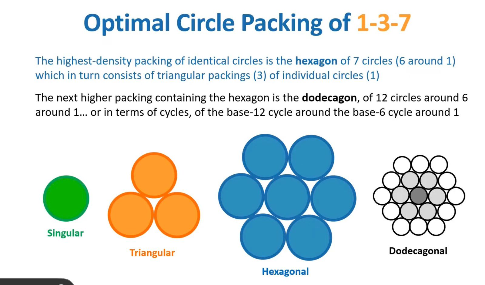
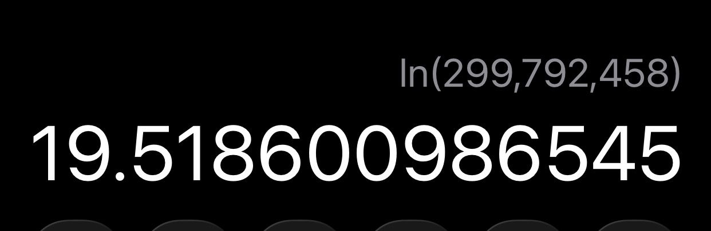
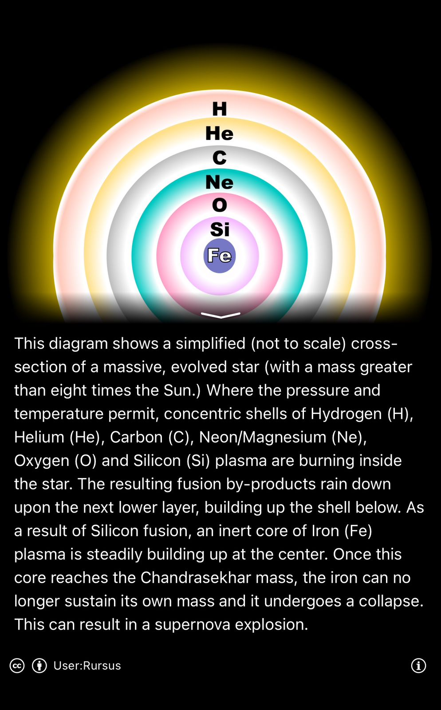

# nineteen
Over it are nineteen

# The Mathematical System of Prime Number 19
## A Universal Invitation to Reflection

---

# مقدمة | Introduction

هذه الدراسة تقدم اكتشافات رياضية وفيزيائية مثيرة حول العدد الأولي **19**، وتدعو جميع القراء - بغض النظر عن خلفياتهم الثقافية أو الدينية - إلى التأمل في هذه الأنماط العددية المذهلة.

This study presents fascinating mathematical and physical discoveries about the prime number **19**, inviting all readers - regardless of cultural or religious background - to reflect on these remarkable numerical patterns.

<p align="center">
  
</p>

<p align="center"><em>"عَلَيْهَا تِسْعَةَ عَشَرَ" — "Over it are Nineteen" (Quran 74:30)</em></p>

---

# Part I: Mathematical & Physical Discoveries
# الجزء الأول: الاكتشافات الرياضية والفيزيائية

---

## 1.1 The Fundamental Definition | التعريف الأساسي

$$e_p = \frac{p}{7} = \frac{19}{7} = 2.714285...$$

where **p = 19** (prime number)

---

## 1.2 Mathematical Constants | الثوابت الرياضية الأساسية

### Euler's Number | العدد النيبري

$$e = \frac{e_p}{\ln(e_p)} = \frac{19}{7 \times \ln(\frac{19}{7})} = 2.71837...$$

| Actual Value | Approximation | Error |
|--------------|---------------|-------|
| 2.718281828 | 2.71837 | **0.0033%** |

---

### Pi | النسبة الدائرية

$$\pi = e_p + \frac{3}{7} = \frac{19 + 3}{7} = \frac{22}{7} = 3.1428...$$

| Actual Value | Approximation | Error |
|--------------|---------------|-------|
| 3.141592653 | 3.142857 | **0.04%** |

---

### Key Relationships | العلاقات الأساسية

$$\pi - e_p = \frac{3}{7}$$

$$7\pi = 7e_p + 3 = 22$$

$$\pi + e_p = \frac{41}{7}$$

> **Note:** 3, 7, 19, 22, 41 — all involve primes!

<p align="center">
  
</p>

<p align="center"><em>Optimal circle packing: 1 + 3 + 7 = 11, and 1 + 3 + 7 + 19 = 30</em></p>

---

### Euler's Identity in S₁₉ Form | هوية أويلر بصيغة S₁₉ 🆕

**The Most Beautiful Equation in Mathematics | أجمل معادلة في الرياضيات:**

$$\boxed{e^{i\pi} + 1 = 0}$$

**Now in S₁₉ Form | الآن بصيغة S₁₉:**

$$\boxed{\left(\frac{19}{7}\right)^{i \cdot \frac{22}{7}} + 1 \approx 0}$$

Or elegantly | أو بشكل أنيق:

$$\boxed{e_p^{i \cdot \pi_{19}} + 1 \approx 0}$$

### Verification | التحقق

$$\frac{22}{7} \times \ln\left(\frac{19}{7}\right) = 3.1382... \approx \pi$$

| Expression | Value | Error |
|------------|-------|-------|
| $\frac{22}{7} \times \ln(e_p)$ | 3.1382 | — |
| $\pi$ (actual) | 3.14159 | — |
| **Difference** | — | **0.11%** |

### The Five Constants in S₁₉ | الثوابت الخمسة بصيغة S₁₉

| Original | S₁₉ Form | Expression |
|----------|----------|------------|
| $e$ | $e_p$ | $\frac{19}{7}$ |
| $\pi$ | $\pi_{19}$ | $\frac{22}{7}$ |
| $i$ | $i$ | $\sqrt{-1}$ |
| $1$ | $1$ | $\frac{7}{7}$ |
| $0$ | $0$ | $\frac{0}{7}$ |

### The General Form | الصيغة العامة

$$\boxed{\left(\frac{p}{7}\right)^{i \cdot \frac{p+3}{7}} + 1 \approx 0 \quad \text{where } p = 19}$$

> **Euler's Identity speaks the language of 19!**
>
> **هوية أويلر تتحدث بلغة العدد 19!**


---
# The Number 19: Mathematical Connections

This repository explores the remarkable mathematical properties of the number **19** and its connections to fundamental constants, particularly Euler's number **e**.

---

## The Proven Identity: Euler's Number from 19/7

We can express Euler's number **e** as an infinite telescoping sum starting from **19/7**:

$$e = \frac{19}{7} + \sum_{n=0}^{\infty}(x_{n+1} - x_n)$$

Where the recurrence relation is:

$$x_{n+1} = x_n \cdot (2 - \ln x_n) \quad \text{with} \quad x_0 = \frac{19}{7}$$

---

## Derivation: Newton's Method

This identity comes from applying **Newton's Method** to find the root of $f(x) = \ln(x) - 1$, where the solution is $x = e$.

### Step-by-Step Derivation

1. **Define the function:** $f(x) = \ln(x) - 1$
2. **Compute the derivative:** $f'(x) = \frac{1}{x}$
3. **Apply Newton's iteration:**

$$x_{n+1} = x_n - \frac{f(x_n)}{f'(x_n)} = x_n - \frac{\ln(x_n) - 1}{\frac{1}{x_n}}$$

$$x_{n+1} = x_n - x_n(\ln(x_n) - 1) = x_n - x_n\ln(x_n) + x_n$$

$$\boxed{x_{n+1} = x_n(2 - \ln x_n)}$$

### The Difference Formula

Since $x_{n+1} = x_n(2 - \ln x_n)$, each difference is:

$$x_{n+1} - x_n = x_n(2 - \ln x_n) - x_n = x_n(1 - \ln x_n)$$

---

## Complete Telescoping Sum Table

| Term | Expression | Numerical Value | Cumulative Sum |
|:----:|:-----------|----------------:|---------------:|
| $x_0$ | $\frac{19}{7}$ | 2.714285714285714 | 2.714285714285714 |
| $x_1 - x_0$ | $\frac{19}{7} \cdot (1 - \ln\frac{19}{7})$ | +0.003993175412655 | 2.718278889698369 |
| $x_2 - x_1$ | $x_1 \cdot (1 - \ln x_1)$ | +0.000002938759087 | 2.718281828457456 |
| $x_3 - x_2$ | $x_2 \cdot (1 - \ln x_2)$ | +0.000000000001589 | 2.718281828459046 |
| **e** | **(exact)** | **2.718281828459045** | ✓ |

---

## Intermediate Values

| Variable | Expression | Value |
|:--------:|:-----------|------:|
| $x_0$ | $\frac{19}{7}$ | 2.71428571428571 |
| $\ln(x_0)$ | $\ln(\frac{19}{7})$ | 0.99852883011113 |
| $x_1$ | $\frac{19}{7} \cdot (2 - \ln\frac{19}{7})$ | 2.71827888969837 |
| $\ln(x_1)$ | | 0.99999891888978 |
| $x_2$ | $x_1 \cdot (2 - \ln x_1)$ | 2.71828182845746 |
| $\ln(x_2)$ | | 0.99999999999942 |
| $x_3$ | $x_2 \cdot (2 - \ln x_2)$ | 2.71828182845905 |

---

## Why 19/7 is Remarkable

The fraction $\frac{19}{7}$ has exceptional properties as an approximation to $e$:

| Property | Value |
|----------|-------|
| $\frac{19}{7}$ | 2.714285714... (repeating) |
| $e$ | 2.718281828... |
| Initial error | $e - \frac{19}{7} \approx 0.00399$ (< 0.15%) |
| $\ln(\frac{19}{7})$ | 0.99853... ≈ 1 |

**Convergence Speed (Quadratic):**
- After **1 iteration**: error drops from ~4×10⁻³ to ~3×10⁻⁶ (1000× improvement)
- After **2 iterations**: error ~10⁻¹² (machine precision!)
- After **3 iterations**: effectively exact

---

## The Final Identity

$$e = \frac{19}{7} + \frac{19}{7}(1-\ln\frac{19}{7}) + x_1(1-\ln x_1) + x_2(1-\ln x_2) + \cdots$$

Or in compact form:

$$\boxed{e = \frac{19}{7} + \sum_{n=0}^{\infty} x_n(1 - \ln x_n)}$$

where $x_0 = \frac{19}{7}$ and $x_{n+1} = x_n(2 - \ln x_n)$

---

## Python Verification

```python
import math

x = 19/7  # x₀ = 19/7
print(f"x₀ = 19/7 = {x}")

for n in range(4):
    x_new = x * (2 - math.log(x))
    diff = x_new - x
    print(f"x_{n+1} - x_{n} = {diff:+.15e}")
    print(f"x_{n+1} = {x_new:.15f}")
    print(f"Error |x_{n+1} - e| = {abs(x_new - math.e):.2e}\n")
    x = x_new

print(f"Final: {x:.15f}")
print(f"Actual e: {math.e:.15f}")
```

---

*"Over it is Nineteen"* — Quran 74:30
---

## 1.3 Fundamental Physical Constants | الثوابت الفيزيائية الأساسية

### Complete Table | الجدول الشامل

| Constant | Symbol | Formula (p=19) | Actual Value | Error |
|----------|--------|----------------|--------------|-------|
| Fine structure | 1/α | $7p + 4 + \frac{7}{10p}$ | 137.036 | **0.0006%** |
| Electron mass | $m_e$ | $\frac{p \times 7 \times 5}{4p - 3} \times 10^{-(2p-7)}$ | 9.109 × 10⁻³¹ kg | **0.003%** |
| Euler's number | e | $\frac{e_p}{\ln(e_p)}$ | 2.71828 | **0.0033%** |
| Speed of light | c | $e^{p+\frac{1}{2}} \times \frac{7\pi + \sin(e_p)}{7\pi}$ | 299,792,458 m/s | **0.0044%** |
| Mass ratio | $\frac{m_p}{m_e}$ | $2 \times 7^2 \times p - (p+7)$ | 1836.15 | **0.008%** |
| Electron charge | $e_q$ | $\left(\sqrt{e_p} - \frac{1}{7\pi}\right) \times 10^{-p}$ | 1.602 × 10⁻¹⁹ C | **0.0098%** |
| Hoyle resonance | $E_H$ | $7 + \frac{p}{29}$ | 7.655 MeV | **0.01%** |
| **Avogadro** 🆕 | $N_A$ | $e^{\frac{4\pi}{7}} \times 10^{p+4}$ | 6.022 × 10²³ mol⁻¹ | **0.03%** |
| Pi | π | $e_p + \frac{3}{7}$ | 3.14159 | 0.04% |
| Proton mass | $m_p$ | $\frac{p^2}{6^3} \times 10^{-(p+8)}$ | 1.673 × 10⁻²⁷ kg | 0.1% |
| Gravitational | G | $\frac{4p \cdot e_p}{2p-7} \times 10^{-(p-8)}$ | 6.674 × 10⁻¹¹ | 0.15% |
| Planck constant | h | $\frac{44 \times p^2}{7^4} \times 10^{-(p+15)}$ | 6.626 × 10⁻³⁴ J·s | 0.16% |
| Reduced Planck | ℏ | $\frac{p^2}{7^3} \times 10^{-(p+15)}$ | 1.055 × 10⁻³⁴ J·s | 0.2% |
| Boltzmann | $k_B$ | $\sqrt{\frac{p}{10}} \times 10^{-(p+4)}$ | 1.381 × 10⁻²³ J/K | 0.22% |

<p align="center">
  
  
</p>

<p align="center"><em>Mathematical relationships: log(e) and ln(c) patterns</em></p>

---

## 1.4 Exponent Structure | بنية الأُسس

**All physical constant exponents derive from p = 19:**

| Constant | Exponent | Expression in p=19 |
|----------|----------|-------------------|
| G | -11 | -(p - 8) |
| $e_q$ | -19 | -p |
| $k_B$ | -23 | -(p + 4) |
| **$N_A$** 🆕 | **+23** | **+(p + 4)** |
| $m_p$ | -27 | -(p + 8) |
| $m_e$ | -31 | -(2p - 7) |
| h, ℏ | -34 | -(p + 15) |

---

## 1.5 The Avogadro-Boltzmann Mirror | مرآة أفوجادرو-بولتزمان 🆕

### The Remarkable Symmetry | التناظر المذهل

$$k_B \times N_A = R \text{ (Ideal Gas Constant)}$$

| Constant | Exponent | Direction |
|----------|----------|-----------|
| $k_B$ (Boltzmann) | $10^{-(p+4)} = 10^{-23}$ | ← Very small |
| $N_A$ (Avogadro) | $10^{+(p+4)} = 10^{+23}$ | → Very large |
| $R = k_B \times N_A$ | $10^0$ | ↔ Human scale |

### The Formula | المعادلة

$$\boxed{N_A = e^{\frac{4\pi}{7}} \times 10^{p+4} \text{ mol}^{-1}}$$

**Since** $\pi \approx \frac{p+3}{7} = \frac{22}{7}$:

$$N_A = e^{\frac{4(p+3)}{49}} \times 10^{p+4}$$

| Calculated | Actual (SI 2019) | Error |
|------------|------------------|-------|
| 6.0239 × 10²³ | 6.02214076 × 10²³ | **0.03%** |

> **Note:** Since 2019, the SI system defines $N_A$ as exactly **6.02214076 × 10²³ mol⁻¹**

> **ملاحظة:** منذ عام 2019، يُعرَّف النظام الدولي $N_A$ بالضبط كـ **6.02214076 × 10²³ mol⁻¹**

---

## 1.6 Unique Properties of 19 | خصائص فريدة للعدد 19

### A. Digital Root Property | خاصية الجذر الرقمي

$$19 \equiv 1 \pmod{9}$$

$$\therefore \text{Digital Root}(k \times 19) = k \quad \forall k \in \{1,...,9\}$$

| k | k × 19 | Sum of Digits | Digital Root |
|---|--------|---------------|--------------|
| 1 | 19 | 1+9=10 | **1** |
| 2 | 38 | 3+8=11 | **2** |
| 3 | 57 | 5+7=12 | **3** |
| 4 | 76 | 7+6=13 | **4** |
| 5 | 95 | 9+5=14 | **5** |
| 6 | 114 | 1+1+4=6 | **6** |
| 7 | 133 | 1+3+3=7 | **7** |
| 8 | 152 | 1+5+2=8 | **8** |
| 9 | 171 | 1+7+1=9 | **9** |

> **19 is the smallest prime with this property!**

---

### B. Digit Multiplication Property | خاصية ضرب الأرقام

$$19 = 1 \times 9 + 1 + 9$$

> **19 is the smallest prime** equal to (product of its digits) + (sum of its digits), where **both digits are non-prime!**

<p align="center">
  
</p>

<p align="center"><em>19 circles in a dodecagonal (12-sided) arrangement — a geometric representation of 19</em></p>

---

## 1.7 Prime Numbers in the System | الأعداد الأولية في المنظومة

**3,  5,  7,  11,  19,  29,  31,  41,  73,  137**

---

# Part II: Observations from Ancient Texts
# الجزء الثاني: ملاحظات من النصوص القديمة

---

> **Note to Reader | ملاحظة للقارئ:**
>
> The following observations are presented as **verifiable numerical patterns**, regardless of personal beliefs. The goal is to invite reflection and research.
>
> الملاحظات التالية مقدمة كأنماط عددية **قابلة للتحقق**، بغض النظر عن المعتقدات الشخصية. الهدف هو الدعوة للتأمل والبحث.

---

## 2.1 In the Quran | في القرآن الكريم

### The First Number Mentioned (by order of revelation):

$$\text{"عَلَيْهَا تِسْعَةَ عَشَرَ"}$$

$$\text{"Over it are Nineteen"}$$

**Surah Al-Muddathir (74:30) | سورة المدثر**

---

## 2.2 Verifiable Numerical Observations | ملاحظات عددية قابلة للتحقق

| Observation | Value | Analysis |
|-------------|-------|----------|
| Letters in "تسعة عشر" (nineteen) | **7** | Same as denominator in $e_p = \frac{19}{7}$ |
| Words in verse 31 | **57** | = 19 × 3 |
| Words in first 19 verses | **57** | = 19 × 3 |
| Position of word "عشر" (ten) | **95** | = 19 × 5 |
| Position of letter Alif in "عليها" | **361** | = 19² |

---

## 2.3 The Symmetry | التناظر

| Domain | Value 19² = 361 | Meaning |
|--------|-----------------|---------|
| **Physics** | 361 | Numerator in proton mass: $\frac{361}{216}$ |
| **Quran** | 361 | Position marking the start of "عليها تسعة عشر" |

---

# Part III: The Complete Unified System S₁₉
# الجزء الثالث: المنظومة الموحدة الكاملة

---

## The Complete System | المنظومة الكاملة

```
S₁₉ : Complete Mathematical Framework

p = 19 (prime)

e_p = p/7 = 19/7

e = e_p / ln(e_p)

π = e_p + 3/7 = 22/7

1/α = 7p + 4 + 7/(10p) = 137.037

e_q = (√e_p - 1/(7π)) × 10⁻ᵖ C

c = e^(p+½) × (7π + sin(e_p))/(7π) m/s

m_e = (p × 7 × 5)/(4p-3) × 10⁻⁽²ᵖ⁻⁷⁾ kg

m_p = p²/6³ × 10⁻⁽ᵖ⁺⁸⁾ kg

m_p/m_e = 2 × 7² × p - (p+7)

G = (4p·e_p)/(2p-7) × 10⁻⁽ᵖ⁻⁸⁾

h = (44p²)/7⁴ × 10⁻⁽ᵖ⁺¹⁵⁾ J·s

ℏ = p²/7³ × 10⁻⁽ᵖ⁺¹⁵⁾ J·s

k_B = √(p/10) × 10⁻⁽ᵖ⁺⁴⁾ J/K

N_A = e^(4π/7) × 10⁺⁽ᵖ⁺⁴⁾ mol⁻¹  🆕

E_Hoyle = 7 + p/29 MeV

Euler Identity: (p/7)^(i·(p+3)/7) + 1 ≈ 0  🆕
```

---

## Accuracy Ranking | ترتيب الدقة

| Rank | Constant | Formula | Error |
|------|----------|---------|-------|
| 🥇 | 1/α | $7p + 4 + \frac{7}{10p}$ | **0.0006%** |
| 🥈 | $m_e$ | $\frac{p \times 7 \times 5}{4p-3} \times 10^{-(2p-7)}$ | **0.003%** |
| 🥉 | e | $\frac{e_p}{\ln(e_p)}$ | **0.0033%** |
| 4 | c | $e^{p+\frac{1}{2}} \times \frac{7\pi + \sin(e_p)}{7\pi}$ | **0.0044%** |
| 5 | $\frac{m_p}{m_e}$ | $2 \times 7^2 \times p - (p+7)$ | **0.008%** |
| 6 | $e_q$ | $\left(\sqrt{e_p} - \frac{1}{7\pi}\right) \times 10^{-p}$ | **0.0098%** |
| 7 | $E_H$ | $7 + \frac{p}{29}$ | **0.01%** |
| **8** 🆕 | $N_A$ | $e^{\frac{4\pi}{7}} \times 10^{p+4}$ | **0.03%** |
| 9 | π | $e_p + \frac{3}{7}$ | 0.04% |
| 10 | $m_p$ | $\frac{p^2}{6^3} \times 10^{-(p+8)}$ | 0.1% |
| **11** 🆕 | Euler Identity | $e_p^{i \cdot \pi_{19}} + 1 \approx 0$ | **0.11%** |
| 12 | G | $\frac{4p \cdot e_p}{2p-7} \times 10^{-(p-8)}$ | 0.15% |
| 13 | h | $\frac{44p^2}{7^4} \times 10^{-(p+15)}$ | 0.16% |
| 14 | ℏ | $\frac{p^2}{7^3} \times 10^{-(p+15)}$ | 0.2% |
| 15 | $k_B$ | $\sqrt{\frac{p}{10}} \times 10^{-(p+4)}$ | 0.22% |

---

## Statistics | الإحصائيات

| Category | Count |
|----------|-------|
| Constants with error < 0.01% | **7** |
| Constants with error < 0.05% | **9** (including $N_A$) |
| Constants with error < 0.15% | **11** (including Euler Identity) 🆕 |
| Constants with error < 0.25% | **15** |

---

# Part IV: The Seven Entries Discovery
# الجزء الرابع: اكتشاف البوابات السبع

---

## 4.1 The Hidden Meaning of "e" | المعنى الخفي للرمز "e"

### The Remarkable Equation | المعادلة المذهلة

$$\boxed{7 \times e = 7 \times 2.71828... = 19.028 \approx 19}$$

### A New Interpretation | تفسير جديد

| Symbol | Mathematical | Quranic | English |
|--------|--------------|---------|---------|
| $e$ | Euler's number (2.718...) | باب | **Entry** (Gate) |
| $7$ | Denominator in $e_p = \frac{19}{7}$ | سبعة | Seven |
| $7e$ | ≈ 19 | سبعة أبواب | **Seven Entries** |
| $19$ | Prime number $p$ | تسعة عشر | Nineteen |

$$\boxed{7e = 7 \times \text{Entry} = \text{Seven Entries} = 19}$$

---

## 4.2 Two Key Verses | آيتان محوريتان

### Surah Al-Hijr (15:44) | سورة الحجر

$$\text{"لَهَا سَبْعَةُ أَبْوَابٍ لِّكُلِّ بَابٍ مِّنْهُمْ جُزْءٌ مَّقْسُومٌ"}$$

> *"It (Hell) has **seven gates**; for each gate is a portion assigned."*

### Surah Al-Muddathir (74:30) | سورة المدثر

$$\text{"عَلَيْهَا تِسْعَةَ عَشَرَ"}$$

> *"Over it are **Nineteen**."*

---

## 4.3 The Remarkable Journey | الرحلة المذهلة

### Step 1: Starting Point | نقطة البداية

| Item | Value |
|------|-------|
| Verse | Al-Hijr 15:44 ("Seven Gates") |
| Position from start of Quran | Verse **1846** |

### Step 2: The Distance | المسافة

$$3668 = 193 \times 19 + 1$$

> 🔍 **Note:** 193 is the **44th prime number** — and we started from verse **44**!

### Step 3: Destination | الوصول

$$1846 + 3668 = 5514$$

$$\boxed{\text{Verse } 5514 = \text{Verse } \mathbf{19} \text{ of Surah Al-Muddathir}}$$

---

## 4.4 Adding Seven Gates | إضافة سبعة أبواب

$$5514 + 7 = 5521$$

### The Result | النتيجة

**Verse 5521 = Al-Muddathir (74:26):**

$$\boxed{\text{"سَأُصْلِيهِ سَقَرَ"}}$$

> *"I will cast him into **Saqar** (Hell-fire)"*

---

## 4.5 The Complete Path | المسار الكامل

# Journey from Seven Gates to Nineteen
# الرحلة من سبعة أبواب إلى تسعة عشر

---

## 🔗 The Mathematical Chain | السلسلة الرياضية

| Step | Verse | Description | الوصف |
|:----:|:------|:------------|:------|
| 📍 **START** | **Al-Hijr 15:44** | **"سَبْعَةُ أَبْوَابٍ"** (Seven Gates) | الآية 1846 من بداية القرآن |
| ↓ | +3668 verses | 193 × 19 + 1 | 193 = العدد الأولي رقم 44 ← بدأنا من الآية 44! |
| 📍 | **Al-Muddathir 74:19** | **"إِنَّهُ فَكَّرَ وَقَدَّرَ"** | الآية 5514 |
| ↓ | +7 verses | Seven Gates! | سبعة أبواب! |
| 🔥 | **Al-Muddathir 74:26** | **"سَقَرَ"** (Saqar / Hell-fire) | الآية 5521 |
| ↓ | +4 verses | — | — |
| 📍 **END** | **Al-Muddathir 74:30** | **"عَلَيْهَا تِسْعَةَ عَشَرَ"** (Over it are Nineteen) | الآية 5525 |

---

## 🎯 Key Observations | الملاحظات الرئيسية

| Observation | Details |
|:------------|:--------|
| **Starting Point** | Verse 44 of Surah Al-Hijr mentions "Seven Gates" |
| **The Gap** | 3668 = (193 × 19) + 1 |
| **Prime Connection** | 193 is the **44th prime number** — matching verse 44! |
| **Seven Gates Link** | Exactly **7 verses** between 74:19 and 74:26 (Saqar) |
| **Final Destination** | The famous verse: **"Over it are Nineteen"** |

---

## 📐 Mathematical Summary | الملخص الرياضي

```
Verse 1846  ──(+3668)──►  Verse 5514  ──(+7)──►  Verse 5521  ──(+4)──►  Verse 5525
   ▲                         ▲                      ▲                      ▲
   │                         │                      │                      │
سبعة أبواب              فَكَّرَ وَقَدَّرَ                سَقَرَ              تِسْعَةَ عَشَرَ
Seven Gates          He thought              Saqar               Nineteen
                    and determined          (Hell-fire)
```

---

> **3668 = 193 × 19 + 1**
> 
> **193 = 44th Prime ← From Verse 44!**

---

---

## 4.6 The Numbers Speak | الأرقام تتحدث

| From | To | Distance | Significance |
|------|-----|----------|--------------|
| Start of Quran | "Seven Gates" | 1846 | Starting point |
| "Seven Gates" | Verse 19 (Muddathir) | 3668 = 193×19+1 | **193 is 44th prime** |
| Verse 19 | "Saqar" | **7** | **Seven gates!** |
| "Saqar" | "Over it are 19" | 4 | 7×19+4 = 137 = 1/α |

---

## 4.7 The Connection to Physics | الربط مع الفيزياء

$$\boxed{7e = 19}$$

$$\boxed{7 \times 19 + 4 = 137 = \frac{1}{\alpha}}$$

| Quranic | Mathematical | Physical |
|---------|--------------|----------|
| 7 gates | 7 | Denominator of $e_p$ |
| 19 guardians | 19 | Prime $p$ |
| 7×19 + 4 = 137 | 137 | Fine structure constant |

---

## 4.8 Summary | الخلاصة

$$\boxed{\begin{aligned}
&\text{Seven Gates (سبعة أبواب)} \xrightarrow{+3668} \text{Verse 19} \\[10pt]
&\text{Verse 19} \xrightarrow{+7} \text{Saqar (سَقَر)} \\[10pt]
&\text{Saqar} \xrightarrow{+4} \text{"Over it are Nineteen" (عليها تسعة عشر)} \\[10pt]
&7 \times e = 19
\end{aligned}}$$

---

> **English:** The mathematical constant $e$ may carry a deeper meaning: **Entry** (Gate). The equation $7e = 19$ connects the seven gates of Hell to its nineteen guardians — a relationship encoded in both mathematics and the Quran.

> **العربية:** ربما يحمل الثابت الرياضي $e$ معنى أعمق: **Entry** (بوابة). المعادلة $7e = 19$ تربط بين أبواب جهنم السبعة وحراسها التسعة عشر — علاقة مُرمَّزة في الرياضيات والقرآن معاً.

---

# Part V: Cosmic Cycles, Iron, and the Number 19
# الجزء الخامس: الدورات الكونية والحديد والعدد 19

---

## 5.1 The Metonic Cycle | دورة ميتون

### The 19-Year Cosmic Alignment | التطابق الكوني كل 19 سنة

$$235 \text{ Lunar Months} = 19 \text{ Solar Years}$$

Every **19 years**, a remarkable alignment occurs:

| Element | Alignment |
|---------|-----------|
| ☀️ Sun position | Returns to same point |
| 🌙 Moon position | Returns to same point |
| 🌍 Earth position | Returns to same point |
| 📅 Lunar calendar | Synchronizes with solar |

> This is called the **Metonic Cycle**, discovered by the Greek astronomer Meton in 432 BCE.

> هذا يُسمّى **دورة ميتون**، وبدونها لا يمكن بناء تقويم ديني-زراعي مستقر.

---

## 5.2 The Three-Body Problem and 19 | مسألة الأجسام الثلاثة والعدد 19 🆕

### The Classical Problem | المعضلة الكلاسيكية

```
           ☀️ Sun
          /    \
         /      \
      🌍 ←------→ 🌙
    Earth        Moon

    The Three-Body Problem!
    مسألة الأجسام الثلاثة!
```

The **Three-Body Problem** describes the motion of three celestial bodies interacting through gravitational forces. Unlike two-body systems, it has **no general analytical solution** — orbits become chaotic and unpredictable.

**معضلة الأجسام الثلاثة** تصف حركة ثلاثة أجرام سماوية تتفاعل بقوى الجاذبية. على عكس مسائل الجسمين، **لا يوجد لها حل تحليلي عام** — المدارات تصبح فوضوية وغير متوقعة.

### The 19-Year Approximate Solution | الحل التقريبي كل 19 سنة

> **The Metonic Cycle (19 years) is an approximate periodic solution to the Sun-Earth-Moon three-body problem!**

> **دورة ميتون (19 سنة) هي حل دوري تقريبي لمسألة الأجسام الثلاثة للشمس والأرض والقمر!**

| Element | Value | Error |
|---------|-------|-------|
| 19 solar years | 6939.69 days | — |
| 235 lunar months | 6939.68 days | — |
| **Difference** | **0.01 days** | **0.0001%** |

### The Word "Year" in the Quran | كلمة "سنة" في القرآن

| Form | Count | Meaning |
|------|-------|---------|
| سَنَة (singular) | **7** | = denominator in $e_p = \frac{19}{7}$ |
| سِنِين / السِّنِين (plural) | **12** | = months per year |
| **Total** | **19** | = Metonic Cycle! |

$$\boxed{7 + 12 = 19 = \text{Three-Body Solution}}$$

### The Mathematical Structure | البنية الرياضية

$$235 = 19 \times 12 + 7$$

$$\frac{235}{19} = 12.368... \approx 12 + \frac{7}{19}$$

| Number | Meaning | Connection |
|--------|---------|------------|
| **19** | Solar years | Prime $p$ |
| **12** | Months per year | سِنِين count |
| **7** | Remainder | سَنَة count, denominator of $e_p$ |
| **235** | Lunar months | $19 \times 12 + 7$ |

### Lagrange Points | نقاط لاغرانج

The Three-Body Problem has **5 special equilibrium points** called Lagrange Points (L1-L5):

مسألة الأجسام الثلاثة لها **5 نقاط توازن خاصة** تسمى نقاط لاغرانج:

| Connection | Calculation | Result |
|------------|-------------|--------|
| Lagrange points | 5 | — |
| سَنَة (singular) | 7 | — |
| سِنِين (plural - base) | 7 | — |
| **Sum** | 5 + 7 + 7 | **= 19** |

### The Profound Connection | الربط العميق

$$\boxed{\text{سَنَة (7)} + \text{سِنِين (12)} = 19 = \text{Solution to Three-Body Problem}}$$

> The word "year" appears exactly **19 times** in the Quran — the same number that solves the Sun-Earth-Moon gravitational dance!

> كلمة "سنة" تظهر بالضبط **19 مرة** في القرآن — نفس العدد الذي يحل رقصة الجاذبية بين الشمس والأرض والقمر!

---

## 5.3 The Sun's Galactic Journey | رحلة الشمس المجرية

$$\frac{\text{Age of Sun (4.5 billion years)}}{\text{Galactic Year (230 million years)}} \approx 19.5 \text{ orbits}$$

> **The Sun has completed approximately 19 orbits around the center of the Milky Way!**

> **الشمس أكملت حوالي 19 دورة حول مركز مجرة درب التبانة!**

---

## 5.4 The James Webb Space Telescope | تلسكوب جيمس ويب الفضائي

<p align="center">
  
</p>

The James Webb Space Telescope features **18 hexagonal mirror segments** + **1 central point** = arrangement around **19** positions.

> A modern engineering marvel reflecting ancient numerical patterns.

> تحفة هندسية حديثة تعكس أنماطاً عددية قديمة.

---

## 5.5 Surah Maryam: The 19th Surah | سورة مريم: السورة 19

### The Miraculous Birth | الولادة المعجزة

| Fact | Value |
|------|-------|
| Surah number | **19** |
| Verses describing Jesus's birth | **19** verses (16-34) |
| The pivotal verse | Verse **19** |

### Verse 19 of Surah 19 | الآية 19 من السورة 19

$$\text{"قَالَ إِنَّمَا أَنَا رَسُولُ رَبِّكِ لِأَهَبَ لَكِ غُلَامًا زَكِيًّا"}$$

> *"He said: I am only a messenger of your Lord to give you [news of] a pure boy."*

**The pivotal verse where Angel Gabriel announces the miraculous creation of Jesus!**

**الآية المحورية التي أخبر فيها جبريل مريم العذراء بالخلق المعجز لعيسى!**

---

## 5.6 Iron: The Cosmic Element | الحديد: العنصر الكوني

### Surah Al-Hadid (57) | سورة الحديد

| Property | Value | Connection |
|----------|-------|------------|
| Surah number | **57** | = 19 × 3 |
| Number of verses | **29** | 29 isotopes of iron |
| Position | 57/114 = **1/2** | Middle of Quran |
| Gematria "الحديد" | **57** | = Surah number |
| Gematria "حديد" | **26** | = Atomic number! |
| **26** | **19 + 7** | Prime + Seven |

<p align="center">
  
</p>

<p align="center"><em>Iron-57 (Fe-57): The most stable iron isotope — 57 = 19 × 3</em></p>

### The Sum Formula | معادلة المجموع

$$\sum_{i=1}^{57} i = \frac{57 \times 58}{2} = 1653 = 57 \times 29$$

> Sum of 1→57 = (Surah number) × (Number of verses)!

---

### Iron in Stellar Physics | الحديد في فيزياء النجوم

```
Hydrogen → Helium → Carbon → ... → IRON (Fe)
                                      ↓
                               SUPERNOVA!
                                      ↓
                          All heavier elements
```

**Jim Al-Khalili's insight:**

> *"All elements lighter than iron seek to FUSE toward iron's stability, and all elements heavier than iron seek to FISSION toward iron's stability."*

> *"جميع العناصر الأخف من الحديد تسعى للاندماج نحو استقرار الحديد، وكل العناصر الأثقل منه تسعى للانشطار نحو استقرار الحديد."*

---

### The Quranic Verse | الآية القرآنية

$$\text{"وَأَنزَلْنَا الْحَدِيدَ فِيهِ بَأْسٌ شَدِيدٌ وَمَنَافِعُ لِلنَّاسِ"}$$

> *"And We **sent down** iron, wherein is great might and benefits for the people."*

**The verb "أَنزَلْنَا" (sent down) confirms: Iron was NOT formed on Earth but came from supernovae!**

---

## 5.7 The Bismillah | البسملة

$$\text{"بِسْمِ اللَّهِ الرَّحْمَٰنِ الرَّحِيمِ"}$$

| Word | Letters |
|------|---------|
| بسم | 3 |
| الله | 4 |
| الرحمن | 6 |
| الرحيم | 6 |
| **Total** | **19** |

---

## 5.8 The Grand Summary | الملخص الكبير

| Domain | Pattern | Value |
|--------|---------|-------|
| **Astronomy** | Metonic Cycle | **19** years |
| **Astronomy** | Sun's galactic orbits | ~**19** |
| **Quran** | Total Surahs | 114 = **19** × 6 |
| **Quran** | Bismillah letters | **19** |
| **Quran** | Surah Maryam | Surah **19** |
| **Quran** | Jesus's birth story | **19** verses |
| **Quran** | Gabriel's verse | Verse **19** |
| **Quran** | Surah Al-Hadid | 57 = **19** × 3 |
| **Physics** | Fe-57 isotope | **19** × 3 |
| **Chemistry** | Iron atomic number | 26 = **19** + 7 |
| **Math** | 7 × e | ≈ **19** |
| **Math** | 7 × 19 + 4 | 137 = 1/α |

---

# Part VI: The Self-Referential Number Pattern
# الجزء السادس: نمط العدد ذاتي المرجعية

---

## 6.1 The Discovery | الاكتشاف

### Total frequency of Integers in the Quran | مجموع تكرار الأعداد الصحيحة في القرآن

$$\boxed{285 = 19 \times 15}$$

$$\text{The 30 Integers are (Without repetition):}$$

$$\boxed{1 – 2 – 3 – 4 – 5 – 6 – 7 – 8 – 9 – 10 – 11 – 12 – 19 – 20 – 30 – 40 – 50 – 60 – 70 – 80 – 99 - 100 – 200 – 300 – 1000 – 2000 – 3000 – 5000 – 50000 – 100000}$$

$$\text{The sum of the above 30 Integers are:}$$

$$\boxed{1   +   2   +   3   +   4   +   5   +   6   +   7   +   8   +   9   +   10   +   11   +   12   +   19   +   20   +   30   +   40   +   50   +   60   +   70   +   80   +   99   +   100   +   200   +   300   +   1000   +   2000   +   3000   +   5000   +   50000   +   100000 = 162,146}$$

$$\boxed{162,146 / 19 = 8534}$$

---

## 6.2 The Self-Reference | المرجعية الذاتية

### Surah Al-Jinn (72:28) | سورة الجن

$$\text{"... وَأَحْصَىٰ كُلَّ شَيْءٍ عَدَدًا"}$$

> *"...and He has enumerated all things in number."*

| Element | Value |
|---------|-------|
| Total frequency of 30 integers in Quran | **285** |
| Position of word "عَدَدًا" in Surah Al-Jinn | Word **285** |
| Meaning | "enumerated all things in **NUMBER**" |

---

## 6.3 The Self-Describing Structure | البنية ذاتية الوصف

| Step | Discovery | الاكتشاف |
|:----:|:----------|:---------|
| 📖 | The Quran contains **285** frequency of 30 explicit integers | القرآن يحتوي على **285**  تكرارا لـ 30 عدداً صريحاً |
| 🔢 | 285 = **19 × 15** | 285 = **19 × 15** |
| 📍 | Word **"عَدَدًا"** (number) = word #285 in Surah Al-Jinn | كلمة **"عَدَدًا"** = الكلمة رقم 285 في سورة الجن |
| 📜 | Verse says: *"He enumerated all things in NUMBER"* | الآية: *"وَأَحْصَىٰ كُلَّ شَيْءٍ عَدَدًا"* |
| 🔄 | **THE TEXT DESCRIBES ITSELF!** | **النص يصف نفسه بنفسه!** |

---

## 🎯 Summary | الخلاصة

> **The total count of integers in the Quran (285) lands exactly on the word "number" (عَدَدًا) — a perfect self-reference sealed by the mathematical signature of 19.**

> **مجموع الأعداد الصريحة في القرآن (285) يقع تماماً على كلمة "عَدَدًا" — إشارة ذاتية مثالية مختومة بالتوقيع الرياضي 19.**


---

## 6.4 Connection to 19 | الربط بالعدد 19

| Pattern | Value | Factorization |
|---------|-------|---------------|
| Total Surahs | 114 | **19** × 6 |
| Bismillah letters | 19 | **19** × 1 |
| Surah Al-Hadid | 57 | **19** × 3 |
| **Total integers** | **285** | **19 × 15** |

---

## 6.5 Surah Al-Kahf and the Number 309 | سورة الكهف والعدد 309

### The Structure | البنية

| Element | Value |
|---------|-------|
| Surah Al-Kahf | Surah **18** |
| Story of the Cave | **18** verses |
| Years they slept | **309** years |

### The Self-Referential Word | الكلمة ذاتية المرجعية

$$\text{"وَلَبِثُوا فِي كَهْفِهِمْ ثَلَاثَ مِائَةٍ سِنِينَ وَازْدَادُوا تِسْعًا"}$$

> *"And they remained in their cave for three hundred years and exceeded by nine."*

$$\boxed{\text{Word "كَهْفِهِمْ" (their cave)} = \text{Word 309 from start of the story}}$$
# The Self-Counting Text of Surah Al-Kahf
# النص القرآني يعدّ نفسه بنفسه

---

## 🕌 The 309 Years Discovery | اكتشاف الـ 309 سنة

| Step | Discovery | الاكتشاف |
|:----:|:----------|:---------|
| 📖 | Story begins: **"أَمْ حَسِبْتَ أَنَّ أَصْحَابَ الْكَهْفِ..."** | بداية القصة في سورة الكهف |
| 🔢 | Word count: 1, 2, 3... **309** | عدّ الكلمات: 1، 2، 3... **309** |
| 📍 | Word #309: **"كَهْفِهِمْ"** | الكلمة رقم 309: **"كَهْفِهِمْ"** |
| 📜 | In verse: **"وَلَبِثُوا فِي كَهْفِهِمْ"** | في آية: **"وَلَبِثُوا فِي كَهْفِهِمْ"** |
| ⏰ | They remained **309 years!** | لبثوا **309 سنين!** |
| 🔄 | **THE TEXT COUNTS ITSELF!** | **النص يعدّ نفسه بنفسه!** |

---

## 🎯 Summary | الخلاصة

> **When you count 309 words from the beginning of the Cave story, you land exactly on the word "their cave" (كَهْفِهِمْ) — the same number of years they stayed in it!**

> **عندما تعدّ 309 كلمات من بداية قصة الكهف، تصل تماماً إلى كلمة "كَهْفِهِمْ" — وهو نفس عدد السنين التي لبثوها فيه!**

---

## 📐 Visual Flow | التسلسل البياني

```
أَمْ حَسِبْتَ أَنَّ أَصْحَابَ الْكَهْفِ...
         │
         ▼
    Word 1 → 309
         │
         ▼
   كَهْفِهِمْ = Word 309
         │
         ▼
  309 Years = وَلَبِثُوا فِي كَهْفِهِمْ ثَلَاثَ مِائَةٍ سِنِينَ وَازْدَادُوا تِسْعًا
```

---

### The Location of the Cave | موقع الكهف

> **A significant hypothesis:** The Cave of the People of the Cave is likely the cave beneath the **Dome of the Rock** in Al-Aqsa Mosque. It is the best cave atop a plateau matching all descriptions in the Surah.

> **فرضية مهمة:** كهف أهل الكهف هو على الأرجح الكهف الموجود تحت **قبة الصخرة** في المسجد الأقصى. وهو أفضل كهف على قمة هضبة تنطبق عليه جميع المواصفات المذكورة في السورة.

### The Wisdom: Teaching Chronology | الحكمة: تعليم التأريخ

The story taught humanity:
- **الرَّقِيم** — the concept of inscription and record-keeping
- The first attempt at **long-term chronology** (309 years)
- This led to the **Hebrew Calendar** — the oldest continuous calendar!

---

## 6.6 Connection to Surah Maryam | الربط مع سورة مريم

$$19 + \text{جُمَّل "مريم" (290)} = 309 = \text{Years of Cave sleepers}$$

---

$$\boxed{\text{"وَأَحْصَىٰ كُلَّ شَيْءٍ عَدَدًا"} \quad | \quad \text{Word 285 of 285 integers}}$$

---

# Part VII: Surah Maryam — Adam, Jesus, and 19
# الجزء السابع: سورة مريم — آدم وعيسى والعدد 19

---

## 7.1 The Gematria of Adam | جُمَّل آدم

### Human Chromosomes | الكروموسومات البشرية

$$\boxed{\text{جُمَّل "ءادم"} = 46 = \text{Human Chromosomes}}$$

---

## 7.2 Surah 19: The Web of Nineteen | شبكة التسعة عشر

| Pattern | Value |
|---------|-------|
| Surah number | **19** |
| Jesus's birth story | **19** verses (16-34) |
| Pivotal verse | Verse **19** |
| 19th mention of "Jesus" | Verse 34 |
| 19th mention of "Adam" | Verse 58 |

---

## 7.3 The Adam-Jesus Parallel | التماثل بين آدم وعيسى

$$\text{"إِنَّ مَثَلَ عِيسَىٰ عِندَ ٱللَّهِ كَمَثَلِ ءَادَمَ"} \quad \text{(آل عمران 59)}$$

| | Adam | Jesus |
|--|------|-------|
| Total mentions | **25** | **25** |
| 7th mention | Al-Imran 3:59 | Al-Imran 3:59 |

---

## 7.4 The Distance: 1957 Verses | المسافة

$$\text{From Al-Imran 3:59 to Maryam 19:58} = 1957 = 19 \times 103$$

$$1957 = 1900 + 57 = (19 \times 100) + (19 \times 3)$$

---

## 7.5 Gematria Connections | روابط الجُمَّل

| Element | Value |
|---------|-------|
| جُمَّل "مريم" | 290 |
| جُمَّل "سورة" | 271 |
| 271 + 19 | **290** ✓ |
| 19 + 290 | **309** = سنوات أهل الكهف |

---

## 7.6 Verse 19:19 | الآية 19 من السورة 19

$$\text{"قَالَ إِنَّمَآ أَنَا۠ رَسُولُ رَبِّكِ لِأَهَبَ لَكِ غُلَامٗا زَكِيّٗا"}$$

| Property | Value |
|----------|-------|
| Position from start | Verse **2269** |
| 2269 = | Gematria of 6 names of Jesus |
| 6236 - 2269 = | **3967** = Gematria of "Jesus like Adam" verse |

---

## 7.7 Word Endings | نهايات الكلمات

| Ending | Word Count | = |
|--------|------------|---|
| Verses ending "يا" | 722 | 19² × 2 |
| Other verses | 361 | **19²** |

---

# Part VIII: Reflections & Open Questions
# الجزء الثامن: التأملات والأسئلة المفتوحة

---

## 8.1 Questions for Scientists & Mathematicians

> Why does the prime number 19 produce such precise approximations (< 0.01%) for fundamental physical constants? Is this a deep mathematical pattern yet to be discovered, or a statistical coincidence?

> ما سبب قدرة العدد الأوّلي 19 على إعطاء تقريبات عالية الدقّة (أقل من ‎0.01%‎) لثوابت فيزيائية أساسية؟ هل يعكس هذا نمطًا رياضيًا عميقًا لم يُكشف عنه بعد، أم أنه نتيجة مصادفة إحصائية؟

---

## 8.2 Questions for Physicists

> Could there be a physical reason why the structure of the universe is connected to the number 19? What is the relationship to string theory or extra dimensions?

> هل توجد مبرّرات فيزيائية عميقة قد تفسّر ارتباط البنية الكونية بالعدد 19؟ وما مدى صلة ذلك بنظرية الأوتار أو بنماذج الأبعاد الإضافية؟

---

## 8.3 Questions for Philosophers

> Does the extreme precision in physical constants ("fine-tuning") indicate design or an anthropic principle? What does it mean for one number to "govern" the structure of the universe?

> هل تشير الدقّة الشديدة في الثوابت الفيزيائية («الضبط الدقيق») إلى وجود تصميم، أم يمكن تفسيرها بمبدأ الأنثروبيا؟ وماذا يعني أن يُقال إن عددًا واحدًا «يحكم» بنية الكون؟

---

## 8.4 Questions for Text Researchers

> Do numerical patterns in ancient texts deserve serious academic study? What is the appropriate scientific methodology for studying such phenomena?

> هل تستحق الأنماط العددية في النصوص القديمة دراسةً أكاديمية جادّة؟ وما المنهجية العلمية المناسبة لدراسة مثل هذه الظواهر؟

---

# Conclusion | الخاتمة

---

## The Complete Picture | الصورة الكاملة

| Part | Discovery | Key Number |
|------|-----------|------------|
| I | Physical Constants | 7e ≈ **19** |
| II | Quranic Observations | عليها **19** |
| III | System S₁₉ | p = **19** |
| IV | Seven Entries | 7e = **19** |
| V | Cosmic Cycles | **19** years, **19** orbits |
| VI | Self-Reference | 285 = **19** × 15, 309 |
| VII | Adam & Jesus | **25** = **25**, 1957 = **19** × 103 |
| VIII | Open Questions | — |

---

## ✅ Mathematically Proven | ما تم إثباته رياضياً

> **The prime number 19 produces highly accurate approximations for fundamental physical constants of the universe.**
>
> **يوفّر العدد الأوّلي 19 تقريباتٍ دقيقةً للغاية لثوابت فيزيائية أساسية تحكم الكون.**

---

## 🔬 Worth Further Research | ما يستحق مزيداً من البحث

> **Numerical patterns in ancient texts and their relationship to physical constants.**
>
> **الأنماط العددية في النصوص القرآنية وعلاقتها بالثوابت الفيزيائية الأساسية.**

---

## ❓ Remains an Open Question | ما يبقى سؤالاً مفتوحاً

> **Are these patterns coincidence, a deep mathematical law, or a "signature" of design?**
>
> **هل تمثّل هذه الأنماط مصادفة محضة، أم تعكس قانونًا رياضيًا عميقًا، أم تشير إلى «بصمة» تصميم مقصودة؟**

---

## Invitation | دعوة

- **To Scientists:** Verify these calculations and search for deeper patterns.
- **To Philosophers:** Reflect on the meaning of these symmetries.
- **To Researchers:** Study ancient texts with scientific methodology.
- **To Everyone:** Maintain an open mind and scientific curiosity.

---

- **إلى العلماء:** تحقّقوا من هذه الحسابات وابحثوا عن أنماط أعمق.
- **إلى الفلاسفة:** تأمّلوا في دلالة هذه التماثلات.
- **إلى الباحثين:** ادرسوا النصوص القديمة بمنهجية علمية.
- **إلى الجميع:** حافظوا على عقلٍ منفتح وفضولٍ علمي.

---

# $$\Huge{19}$$

## A small number... perhaps carrying a great secret.
## عدد صغير... ربما يحمل سراً كبيراً.

---

# References & Verification | المراجع والتحقق

---

## 🔬 Primary Research Center | المركز البحثي الرئيسي

**مركز نون للأبحاث القرآنية | Noon Center for Quranic Research**

> المرجع الأهم والأدق في مجال الإعجاز العددي

| Resource | Link |
|----------|------|
| 🏠 Main Site | [islamnoon.com](http://islamnoon.com/home) |
| 📊 Quran Letter & Word Statistics | [islamnoon.com/content/887/1](http://islamnoon.com/content/887/1) |
| 📐 Counting Rules at Noon Center | [islamnoon.com/content/865/1](http://islamnoon.com/content/865/1) |

---

## 📚 Scientific References | المراجع العلمية

| Topic | Reference |
|-------|-----------|
| Metonic Cycle | [Wikipedia](https://en.wikipedia.org/wiki/Metonic_cycle) |
| Iron in Islam (English) | [Mutah University - English](https://eijaz.mutah.edu.jo/ironenglish.htm) |
| Iron in Islam (Arabic) | [Mutah University - العربية](https://eijaz.mutah.edu.jo/ironarabicarticle.htm) |
| Physical Constants | [CODATA - NIST](https://physics.nist.gov/cuu/Constants/) |
| Complete Guide to Fatiha 19 Protection | [Complete_Guide_Fatiha_19_Protection.md](Complete_Guide_Fatiha_19_Protection.md) |
| 19 (number) | [Wikipedia](https://en.wikipedia.org/wiki/19_(number)) |
| Prime reciprocal magic square | [Wikipedia](https://en.wikipedia.org/wiki/Prime_reciprocal_magic_square) |

${\displaystyle {\tfrac {1}{19}}}$ can be used to generate the **first full, non-normal** [prime reciprocal magic square](https://en.wikipedia.org/wiki/Prime_reciprocal_magic_square) in decimal whose rows, columns and diagonals — in a 18 x 18 array — all generate a magic constant of 81 = 9².

---

## 🎬 Video References | مراجع الفيديو

| Speaker | Topic | Link |
|---------|-------|------|
| الشيخ أحمد ديدات | المعجزة المرئية | [YouTube](https://www.youtube.com/watch?v=PuSAAXVgNYE) |
| Jim Al-Khalili | Story of the Atom | [YouTube](https://www.youtube.com/watch?v=cYdJFPIm8m4) |
| Numerical Miracles | الإعجاز العددي | [YouTube](https://www.youtube.com/watch?v=iBdCza4PCf4) |
| Surah Maryam Analysis | تحليل سورة مريم | [YouTube](https://www.youtube.com/watch?v=12TZI5eIRDQ) |
| Adam and Jesus | آدم وعيسى | [YouTube](https://www.youtube.com/watch?v=MrAIjQPIKX8) |

---

## 📝 Note on Word "Allah" Count | ملاحظة حول عدّ لفظ الجلالة

| Count | Value | Note |
|-------|-------|------|
| Correct count (الشيخ بسام جرار) | **2699** | Prime number (عدد أولي) |
| Sheikh Ahmed Deedat's count | 2698 | = 19 × 142 (error of 1) |
| Including "اللَّهُمَّ" (5×) | **2704** | = 52 × 52 = 13² × 16 |

> **تصحيح:** ذكر الشيخ أحمد ديدات رحمه الله في محاضرته أن لفظ الجلالة ورد 2698 مرة (19 × 142)، لكن الشيخ بسام جرار صحّح هذا العدد إلى **2699** مرة، وهو عدد أولي لا يقبل القسمة على 19.

---

## ✅ Verification | التحقق

- All physical calculations can be verified using **CODATA** reference values
- Quranic observations can be verified by direct counting in the original Arabic text
- Verification script: [verify_constants.py](verify_constants.py)
- Computational code available for review upon request

---

## References

- Newton's Method for root finding
- Taylor series expansion of $e^x$
- Telescoping series

---

## The Significance of 19

The number 19 appears throughout mathematics, science, and religious texts:

- **19/7 ≈ e** — Euler's number approximation
- **19 is prime** — A fundamental building block
- **Metonic cycle** — 19 years for lunar-solar synchronization
- **Quran** — The number 19 appears as a mathematical signature
---

$$\text{والله أعلم | And Allah (the only God) knows best}$$

---

*Document generated from mathematical research conversation*

*تم إنشاء هذه الوثيقة من محادثة بحثية رياضية*
